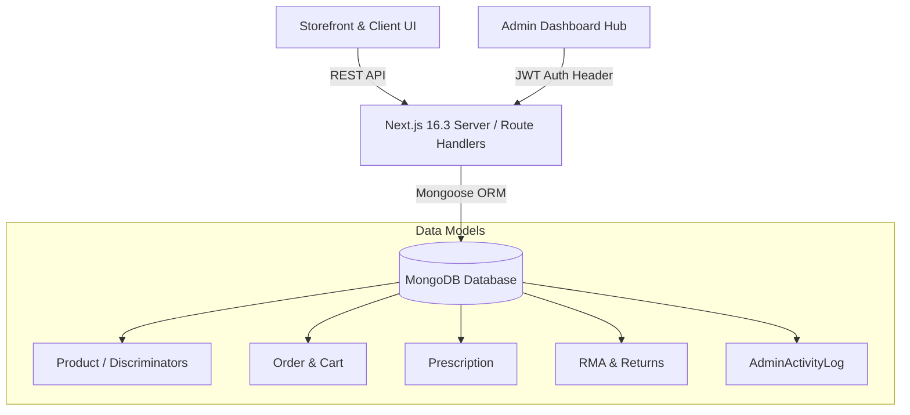
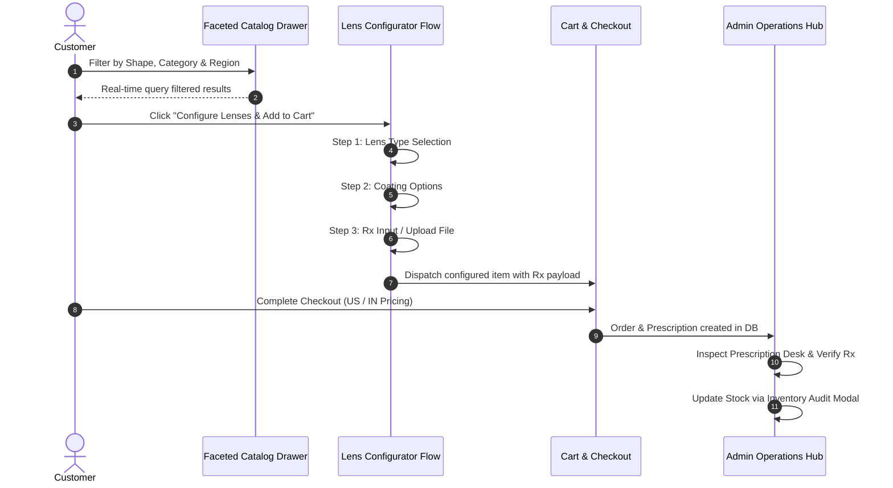

# JEMY — Optical Precision & Luxury E-Commerce Ecosystem

## 1. System Architecture & Tech Stack

Jemy is an enterprise-grade, high-fidelity optical e-commerce platform and operational management hub built with modern full-stack web technologies.

* **Core Framework**: [Next.js 16.3 (App Router with Turbopack)](file:///d:/jemy/package.json)
* **Database & ORM**: MongoDB with [Mongoose Schemas & Discriminators](file:///d:/jemy/src/models/Product.ts)
* **State Management**: [Zustand](file:///d:/jemy/src/store/useAdminStore.ts) (Admin UI state, Cart state, Filter drawers)
* **Styling & Design System**: Tailwind CSS with custom CSS Variables (`--color-gold-primary`, `--color-indigo-950`, `--color-admin-surface`, etc.) following an **"Industrial Elegance"** aesthetic.
* **Animations**: Framer Motion (`framer-motion`) for micro-interactions, page transitions, sliding filter drawers, and interactive modal flows.
* **Authentication**: JWT-based stateless auth ([`checkAdminAuth`](file:///d:/jemy/src/lib/auth.ts)) with localStorage client token persistence (Admin JWT lifespan extended to 7 Days for smoother dev sessions).

---

## 2. System Architecture Diagram



---

## 3. Data Models & Schemas

### 3.1 Product Schema (`src/models/Product.ts`)
Uses Mongoose discriminators (`category` key) to extend base products into specialized eyewear products.

* **Base Schema Fields**: `name`, `slug`, `description`, `category` (`sunglasses` | `eyeglasses` | `perfume`), `images`, `pricing` (`US` and `IN` currency objects), `stock`, `sales`, `aesthetics`, `requiresPrescription`, `gender`, `regionAvailability` (`US` | `IN` | `BOTH`).
* **Eyewear Discriminator (`EyewearProduct`)**: Adds `frameMaterial`, `frameShape`, `frameColor`, `frameSize`, `dimensions` (`lensWidth`, `bridgeWidth`, `templeLength`), `supportedLensTypes`, `powerRanges`.
* **Sunglasses Discriminator (`SunglassesProduct`)**: Inherits eyewear attributes with specialized tinting and polarization flags.
* **Hot-Reload Safeguard**: Incorporates getter functions (`getEyewearProduct()`, `getSunglassesProduct()`) to prevent Mongoose `OverwriteModelError` during Next.js dev server re-evaluations.

### 3.2 Prescription Schema (`src/models/Prescription.ts`)
Stores customer prescription (Rx) parameters:
* `sphere`, `cylinder`, `axis`, `pupillaryDistance` (PD) for left & right eyes.
* Optional file attachments (image/PDF upload).
* Status flags: `pending`, `verified`, `rejected`.

### 3.3 Admin Activity Log (`src/models/AdminActivityLog.ts`)
Audits all operational actions taken in the admin portal (`created_product`, `adjusted_stock`, `approved_prescription`, `processed_rma`) tagged with `adminId`, `entityType`, `entityId`, and `ipAddress`.

### 3.4 Marketing & Promotions Engine (`src/models/`)
A robust CMS handles storefront visual merchandising and discounting:
* **`Advertisement.ts`**: Manages hero banners, floating storefront flyers, and scrolling marquees.
* **`Merchandising.ts`**: Powers the "Recommendations", "Sun Collection", and "Editorial" scroll stacks on the homepage.
* **`Campaign.ts` & `Offer.ts`**: Handles seasonal sales events and BOGO logic.
* **`Coupon.ts`**: Manages unique promo codes, usage limits, and region-specific validity.

### 3.5 Customer Service & Auditing (`src/models/`)
* **`RMA.ts`**: Return Merchandise Authorization for processing returns and exchanges.
* **`CartEvent.ts`**: Stores telemetry of items added to carts for live dashboard auditing.
* **`Contact.ts` & `Blog.ts`**: Standard CRM intake and SEO editorial content schemas.

### 3.4 Order & Cart Payload Architecture
* The Cart system passes a complex `config` payload when adding products. This payload captures `frameColor`, `frameSize`, `productType` ("Powered Eyeglass" | "Zero Power" | "Reading Glasses"), and detailed `rxData` (sphere, cylinder, axis, ADD) inputted via the `LensConfiguratorModal`.

---

## 4. End-to-End User & Operational Flows



### 4.1 Faceted Catalog Filtering
* Real-time dynamic filter drawer sliding out from the right.
* State synchronized bi-directionally with URL query params (`?shape=round&category=eyeglasses&region=US`).
* Filters by frame shape, material, size, gender, and multi-region availability.
* **Mobile Enhancements**: Features a Floating Action Button (FAB) pinned to the bottom-right for ergonomic thumb-reach filter access.

### 4.2 Multi-Step Optical Rx Experience (`LensConfiguratorModal.tsx`)
1. **Lens Selection**: Single Vision, Progressive, Readers, or Non-Prescription.
2. **Lens Coatings**: Anti-reflective, Scratch Resistance, Blue-Light Filter, Photochromic (Transitions).
3. **Prescription Submission (`PrescriptionInputStep.tsx`)**: Manual grid input (OD/OS sphere, cylinder, axis, PD) or direct image/PDF file upload. Fetches saved Rx data if logged in. *(Mobile styling fix implemented on `<option>` tags to prevent invisible text in native dark mode dropdowns)*.
4. **Cart Integration**: Encapsulates the entire optical configuration into the cart item model.

### 4.3 Multi-Region E-Commerce (US & IN)
* Dual pricing structure (`pricing.US.amount` in USD vs `pricing.IN.amount` in INR).
* Product-level `regionAvailability` tag (`US`, `IN`, `BOTH`) ensures region-restricted catalog visibility.

### 4.4 Product Details Page (PDP) Architecture
The PDP (`src/app/products/[slug]/page.tsx`) is a highly bespoke, modular page designed for high conversion:
* **Interactive Selections**: Users select `ProductType` and `FrameColor` (featuring circular visual swatches with dynamic "Few Left" stock warnings).
* **Information Hierarchy**: Complex text data is collapsed into a Framer Motion-powered `ProductAccordion` (Description, Shipping, Returns).
* **Component Deep-Dive**: The `ProductHighlightsTabs` component cross-fades specialized optical details (Material, Hinge, Temple, Nosepad).
* **Social Proof**: Features an `InspirationLooks` horizontal scrolling carousel of lifestyle imagery and a dedicated `ProductReviews` section.

---

## 5. Admin Operations Hub & Responsive Dashboard

### 5.1 Responsive Layout Architecture
* **Global Component Exclusion**: The global storefront [`Navbar`](file:///d:/jemy/src/components/layout/Navbar.tsx) and [`Footer`](file:///d:/jemy/src/components/layout/Footer.tsx) detect `/admin` routes via `usePathname()` and render `null` to isolate the admin environment.
* **State-Driven Sidebar**: Powered by Zustand [`useAdminStore`](file:///d:/jemy/src/store/useAdminStore.ts).
  * **Desktop**: Fixed left sidebar (`w-64`) with main content offset (`lg:ml-64`).
  * **Mobile**: Full-screen slide-over drawer with backdrop blur overlay and hamburger toggle in [`AdminHeader`](file:///d:/jemy/src/components/admin/AdminHeader.tsx).

### 5.2 Dashboard Telemetry & Operations
* **KPI Metrics**: Real-time sales aggregate, Low-Stock Alert counts, Pending Rx queue depth.
* **7-Day Sales Trend**: Custom CSS/SVG-based bar chart visualization.
* **Live Cart Activity Audit**: Telemetry feed monitoring live cart additions.
* **Inventory Audit Desk**: Quick-stock adjustment modal with mandatory audit reason logging.

### 5.3 Region Availability Admin Logic
When publishing a product in the Admin panel (`ProductEditorClient.tsx`), if the user explicitly targets a single region (e.g., "US"), the frontend dynamically hides the IN pricing field and strictly deletes the IN payload key before sending the POST request, preventing database pollution and ensuring accurate validations.

---

## 6. Animations & Motion System (Deep Dive)

The UI implements an intricate animation architecture blending **GSAP (GreenSock)** for complex scroll-linked timelines, **Framer Motion** for physical component simulations and mounting, and **Tailwind CSS** for hardware-accelerated micro-interactions. The aesthetic is strictly governed by **Industrial Elegance** principles—animations are deliberate, machined, and use custom easing curves (e.g., `[0.19, 1, 0.22, 1]`).

### 6.1 GSAP & ScrollTrigger: The Core Engine
GSAP is the backbone for all scroll-dependent physics. We use `@gsap/react` to safely scope animations within React's lifecycle.

#### A. Global Theme Shifting (`src/app/page.tsx`)
We use GSAP to dynamically transition the global CSS variables (`--theme-bg`, `--theme-text`) based on the user's scroll position. This creates a seamless light-to-dark mode wipe.

> [!WARNING]  
> **Critical Developer Note**: Never apply Tailwind's `transition-colors` on a container where GSAP is animating CSS variables. It causes horrific frame-rate stutter as the browser tries to run CSS transitions on top of GSAP's 60fps variable updates.

```tsx
useGSAP(() => {
  const themeCtx = gsap.context(() => {
    ScrollTrigger.create({
      trigger: '#manifesto-section', // ID of the target section
      start: 'top 40%', // Triggers when top of section hits 40% of viewport
      end: 'bottom 40%',
      // Animating the raw CSS variables injected in the style prop
      onEnter: () => gsap.to(themeWrapperRef.current, { '--theme-bg': '#1C2740', '--theme-text': '#EAEBE6', duration: 0.8, ease: 'power2.out' }),
      onLeaveBack: () => gsap.to(themeWrapperRef.current, { '--theme-bg': '#EAEBE6', '--theme-text': '#1C2740', duration: 0.8, ease: 'power2.out' }),
    });
  }, themeWrapperRef);
  return () => themeCtx.revert(); // Crucial for cleanup in Next.js
}, []);
```

#### B. Pinned Editorial Layouts
For the "Editorial Lookbook", we pin a container and scrub through a crossfade timeline based on scroll progress.

### 6.2 Preloader & Cinematic Timing (`Preloader.tsx`)
* **Session Persistence**: Checks `sessionStorage.getItem('jemy_preloader_seen')` on mount. If present, it bypasses the animation entirely.
* **Timing Matrix**: We utilize a rapid 90ms interval randomizer to simulate heavy asset loading, culminating in exactly a **3.1 second** timeout before lifting the mask.
* **Hero Sync (`CardExplosion.tsx`)**: On mobile devices, the GSAP entrance animation for the Hero Typography (`See the World Differently.`) calculates a precise `3.2s` delay *only* if the preloader is actively running. This ensures the text doesn't pop in too early behind the mask.

### 6.3 Framer Motion: Layout & Orchestration
Framer Motion handles layout transitions, modal mounting (`AnimatePresence`), and staggered entrance animations.

#### A. Hero Tagline Stagger
We use `motion.span` to create a "shutter" reveal effect where text slides up from behind an overflow mask. Notice the highly machined cubic-bezier easing `[0.19, 1, 0.22, 1]`.

```tsx
<h1 className="font-clash font-[700] uppercase flex flex-col items-center">
  {/* The overflow-hidden wrapper creates the mask boundary */}
  <span className="overflow-hidden block pt-3 md:pt-6 -mt-3 md:-mt-6">
    <motion.span
      initial={{ y: "110%", rotateZ: 4 }} // Starts below the mask, slightly tilted
      animate={{ y: 0, rotateZ: 0 }}
      transition={{ duration: 0.9, delay: 3.1, ease: [0.19, 1, 0.22, 1] }} // Delayed to sync with Preloader unmount
      className="block origin-bottom-left"
    >
      The Atelier
    </motion.span>
  </span>
</h1>
```

### 6.4 Complex Responsive Grids (Tailwind)
Our responsive layouts go beyond simple breakpoints. The `FeaturedCollection` implements a highly bespoke "Hybrid Grid" on mobile (2 squares on top, 1 rectangle on bottom).

### 6.5 The "Nuclear" Mobile Overflow Fix
A common issue in Next.js + Tailwind is horizontal scrolling on mobile due to oversized text clamps (e.g., `clamp(3rem, 12vw, 12rem)`).
We lock the entire layout down in the main `page.tsx` wrapper to guarantee the `100vw` limit is respected:

```tsx
<div 
  ref={themeWrapperRef} 
  // 'overflow-x-hidden max-w-[100vw]' guarantees no horizontal scrollbar bleed on iOS/Safari
  className="theme-wrapper overflow-x-hidden w-full max-w-[100vw]"
>
```

### 6.6 Micro-Animations & Component Locations
If you need to edit specific interactive elements, refer to this precise directory map:

* **Shutter Preloader Sequence** -> [`src/components/layout/Preloader.tsx`](file:///d:/jemy/src/components/layout/Preloader.tsx)
  * *Code:* `motion.div` mask wiping up and the staggered text reveal.
* **Product Image Scrubber (Hover to change views)** -> [`src/components/ui/ScrubbableProductCard.tsx`](file:///d:/jemy/src/components/ui/ScrubbableProductCard.tsx)
  * *Code:* `onMouseMove` boundary calculations dynamically updating `activeIndex` based on cursor X position.
* **Hamburger Menu Line Expansion** -> [`src/components/layout/Navbar.tsx`](file:///d:/jemy/src/components/layout/Navbar.tsx)
  * *Code:* Tailwind `group-hover:w-full` logic applied to individual spans mimicking a bespoke drawer icon.
* **Stretching Velocity Cursor** -> [`src/components/ui/CustomCursor.tsx`](file:///d:/jemy/src/components/ui/CustomCursor.tsx) (and injected globally via `page.tsx`)
  * *Code:* Calculating `Math.abs(currentY - lastY)` on scroll to dynamically skew `transform: scaleY()`.
* **Click Physics (Explosions/Decks)** -> [`src/components/ui/CardExplosion.tsx`](file:///d:/jemy/src/components/ui/CardExplosion.tsx) & `StackedGlassDeck.tsx`
  * *Code:* Contains Framer Motion `useAnimation` controls for complex particle scattering.

---

## 7. Key Code Files Index

* **Product Schema**: [`src/models/Product.ts`](file:///d:/jemy/src/models/Product.ts)
* **Auth Core**: [`src/lib/auth.ts`](file:///d:/jemy/src/lib/auth.ts)
* **Storefront Entry**: [`src/app/page.tsx`](file:///d:/jemy/src/app/page.tsx) - *Contains GSAP ScrollTriggers & Hero animations*
* **Product Card**: [`src/components/ui/ScrubbableProductCard.tsx`](file:///d:/jemy/src/components/ui/ScrubbableProductCard.tsx) - *Contains dynamic aspect ratio logic*
* **Admin Layout**: [`src/app/admin/layout.tsx`](file:///d:/jemy/src/app/admin/layout.tsx)
* **Admin Dashboard**: [`src/app/admin/page.tsx`](file:///d:/jemy/src/app/admin/page.tsx)
* **Admin Layout Store**: [`src/store/useAdminStore.ts`](file:///d:/jemy/src/store/useAdminStore.ts)
* **Preloader Engine**: [`src/components/layout/Preloader.tsx`](file:///d:/jemy/src/components/layout/Preloader.tsx)
* **Product Details Page**: [`src/app/products/[slug]/page.tsx`](file:///d:/jemy/src/app/products/[slug]/page.tsx)
* **Rx Input System**: [`src/components/eyewear/PrescriptionInputStep.tsx`](file:///d:/jemy/src/components/eyewear/PrescriptionInputStep.tsx)
* **Admin Product Editor**: [`src/app/admin/products/editor/new/ProductEditorClient.tsx`](file:///d:/jemy/src/app/admin/products/editor/new/ProductEditorClient.tsx)

---

## 8. Logic, Systems, and Animation Locations (For Next Agent)

To the next Agent picking up this codebase: this is an enterprise-grade luxury e-commerce platform. When making changes, pay strict attention to the following subsystems:

### 8.1 Complex Animations & Where to Find Them
- **Homepage GSAP Scrollytelling**: The majority of the scroll-based GSAP animations (theme switching, `EditorialLookbook` pinning, `ManifestoSection` macro zoom, `InfiniteMarquee` text sliding) are housed directly in `src/app/page.tsx`.
- **Card Explosions & Physics**: The 3D scatter effect is located in `src/components/ui/CardExplosion.tsx` and `src/components/ui/StackedGlassDeck.tsx`. These use a mix of `framer-motion` and `gsap`.
- **Preloader Synchronization**: Located in `src/components/layout/Preloader.tsx`. The preloader sets a 3.1s timeout and sets a `jemy_preloader_seen` flag in `sessionStorage`. **Important:** The Hero text animation in `page.tsx` (`<motion.span>`) has a hardcoded delay of `3.1s` and `3.2s` to sync perfectly with this mask lifting. If you change the preloader duration, you MUST update the delay in `page.tsx`.
- **Dual Image Reveal**: The scroll-based image rotation effect is in `src/components/ui/DualImageReveal.tsx`.
- **Cursor Stretching Effect**: The velocity-based cursor stretching logic is in `src/components/ui/CustomCursor.tsx` and uses raw `requestAnimationFrame`/`scroll` event listeners modifying the `transform` style for 60fps performance without React state lag.

### 8.2 Regional Pricing & Store Logic (US vs IN)
- **Middleware Routing**: `src/middleware.ts` detects the Vercel edge country or a user-overridden cookie (`jemy_region`) to determine if the user is in the US or India (IN).
- **Client State**: `src/store/useRegionStore.ts` uses Zustand to hold the active region (`US` or `IN`) and currency (`USD` or `INR`). It synchronizes this with the `jemy_region` cookie.
- **Product Schema**: `src/models/Product.ts` contains `pricing.US.amount` and `pricing.IN.amount`.
- **Admin Saving Logic**: In `src/app/admin/products/editor/new/ProductEditorClient.tsx`, when a product is saved, the frontend checks the `regionAvailability` dropdown. If it is set to "US", the frontend actively strips out the "IN" pricing object from the POST payload to prevent `$0` entries in the DB.

### 8.3 Cart & Prescription Flow
- **Cart API & Hooks**: We use `react-query` to manage cart mutations. The hooks are defined in `src/hooks/useCart.ts` and communicate with `src/app/api/cart/route.ts`.
- **Global Cart State**: `src/store/useCartStore.ts` manages the UI state of the `CartDrawer` (open/close) and an optimistic `itemCount` integer so the Navbar bubble updates instantly.
- **Lens Configurator**: The massive modal for building prescription glasses is `src/components/eyewear/LensConfiguratorModal.tsx`. It compiles `productType` (Single Vision, Progressive), `rxData` (Sphere, Cylinder, Axis, PD), and `frameColor` into a single `config` object which is injected into the Cart Item payload.
- **Mobile Dropdown Fix**: In `src/components/eyewear/PrescriptionInputStep.tsx`, the native `<select>` dropdowns have `<option>` tags explicitly styled with `text-gray-900 bg-white`. Do not remove this, as native mobile dark modes will render the text invisible otherwise.

### 8.4 Mongoose Discriminators
- We use Discriminators in `src/models/Product.ts`. The base model is `Product`. We export `getEyewearProduct()` and `getSunglassesProduct()` functions to retrieve the discriminators.
- **Why functions?** Next.js hot-reloads execute files multiple times. If we run `Product.discriminator('Eyewear', schema)` on every hot-reload, Mongoose throws an `OverwriteModelError`. Always use `getEyewearProduct()` when interacting with eyewear documents in API routes.

---

## 9. Homepage Section Render Order (`src/app/page.tsx` ~line 812)

Sections render in this exact order — reference when inserting or reordering:
1. `<HeroSection>` — fullscreen video, Framer Motion title entrance with `3.1s` / `3.2s` delay to sync with Preloader
2. `<InfiniteMarquee>` ×2 — GSAP `xPercent` loop, alternating directions
3. `<FeaturedCollection title="Bestsellers">` — fetches `/api/products/bestsellers`
4. `<FeaturedCollection title="Recommendations">` — wrapped in `#early-dark-zone` div (triggers dark CSS vars via GSAP ScrollTrigger)
5. `<FeaturedCollection title="Sun Collection">` — fetches `/api/products?category=sunglasses`
6. `<CardExplosion>` — Framer Motion particle scatter on click
7. `<AdvertisementScrollStack>` — Native CSS `position: sticky` stacking deck for editorial campaigns (replaced the legacy GSAP EditorialLookbook for better mobile stability).
8. `<StackedGlassDeck>` — GSAP 3D perspective card deck, 100vh per card
9. `<ManifestoSection>` — GSAP word scrub + macro zoom (this is the `#manifesto-section` dark trigger)
10. `<ShopByGeometry>` — GSAP stagger blur-in category cards
11. `<DualImageReveal>` — GSAP scroll-linked dual image rotation
12. `<FeaturesGrid>` — static 3-column with CSS hover ambient glow
13. `<NewsletterSection>` — POST `/api/user/newsletter`, AnimatePresence success swap

## 10. Full API Route Map (`src/app/api/`)

| Route | Method | Purpose |
|---|---|---|
| `/api/auth/login` | POST | JWT login for users & admins |
| `/api/auth/register` | POST | Customer registration |
| `/api/cart` | GET/POST/PATCH/DELETE | Session-based cart CRUD |
| `/api/products` | GET | Paginated catalog (supports: `shape`, `category`, `material`, `size`, `sort`, `limit`) |
| `/api/products/bestsellers` | GET | Top products sorted by `sales` field |
| `/api/checkout` | POST | Creates Order doc, triggers payment gateway |
| `/api/payment/webhook/razorpay` | POST | Razorpay HMAC verification webhook |
| `/api/events/cart` | POST | Wishlist/cart event logging for Admin live-feed |
| `/api/reviews` | GET/POST | Product review CRUD (model exists, PDP not wired yet) |
| `/api/user/newsletter` | POST | Saves email to Newsletter model |
| `/api/admin/products` | GET/POST | List & create products (auth-gated) |
| `/api/admin/orders` | GET/PATCH | Order list & status updates |
| `/api/admin/prescriptions` | GET/PATCH | Rx verification queue |
| `/api/admin/dashboard` | GET | KPI aggregations (revenue, low-stock, pending Rx) |
| `/api/admin/rma` | GET/POST/PATCH | Returns & exchange management |
| `/api/admin/users` | GET/PATCH | User list, suspend, role changes |
| `/api/admin/coupons` | GET/POST/PATCH/DELETE | Discount code management |
| `/api/admin/marketing/*` | CRUD | Sub-routes for campaigns, merchandising, safety-checks |
| `/api/admin/advertisements` | GET/POST/PATCH | Storefront banner management |
| `/api/admin/cart-audit` | GET | Telemetry feed for live customer cart activity |
| `/api/admin/config` | GET/PATCH | Global platform settings |
| `/api/admin/export` | GET | CSV data export endpoint |
| `/api/feed/google-merchant` | GET | Google Merchant Center product XML feed |

## 11. Outstanding Work for Next Agent

- **Product Reviews**: `src/models/Review.ts` exists. `ProductReviews.tsx` on the PDP uses **mock data**. Wire it to `/api/reviews` to go live.
- **Inspiration Looks**: `InspirationLooks.tsx` on PDP also uses static images — needs a CMS or DB-backed model.
- **Face Shape Quiz**: `FaceShapeQuizModal.tsx` runs the quiz client-side but does **not** persist the recommended shape to the user's profile.
- **Google Merchant Feed**: `src/app/feed/google-merchant/route.ts` — its product query needs to filter by `regionAvailability` so IN-only products don't appear in the US feed.

